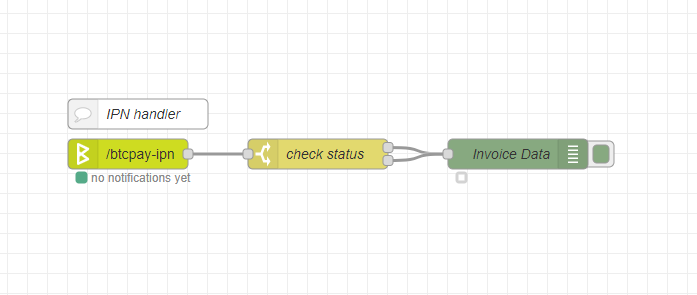

# BTCPay Nodes

<a href="https://nodered.org" target="_blank">Node-RED</a> nodes to interact with <a href="https://btcpayserver.org/" target="_blank">BTCPay Server</a>.

## Install

Run the following command in the root directory of your Node-RED instance:

```
npm install --save node-red-contrib-btcpay
```

## Usage

This set provides 2 nodes:

- `btcpay-api` - a BTCPay API client node. It makes API requests by sending `msg.payload` data to the specified API endpoint and outputs the response data as `msg.payload`.
- `btcpay-ipn` - a BTCPay IPN listener node. It listens to BTCPay Instant Payment Notifications and outputs the invoice object as the `msg.payload`.

### Configuration

You first need to create a new BTCPay store:

1. Log in to your BTCPay Server instance
2. Go to Stores menu
3. Click on `Create a new store`
4. Enter a name
5. Push `Create`

Now you need to pair the client with your BTCPay store:

1. Navigate to `Stores > Settings > Access Tokens` on your BTCPay Server
2. Create a new token
3. Leave PublicKey blank
4. Request pairing
5. Copy pairing code
6. Open your Node-RED instance
7. Drag & drop the `btcpay api` node from the palette to the workspace and double-click on it, to open the node editor
8. In the `Client` dropdown menu pick the `Add New btcpay-api-config` option and press the pencil button at the right to add a new API configuration
9. Enter the https URL to your BTCPay Server instance
10. Paste the pairing code you copied on step 5
11. Click the `Pair client` button - the private key and token fields will be automatically filled with your api credentials
12. Push `Update`

### Making API requests

To make requests using the `btcpay-api` node, set the http method and the url path to the API endpoint the node will call. These can be either specified in the node settings, or provided in `msg.method` (if the method is "via msg.method") and in `msg.path` (if the path is empty). The request body is the data in `msg.payload`.

After executing a request the node returns a message with the response data set to `msg.payload`.

### Handling Instant Payment Notifications (IPN)

To receive Instant Payment Notifications with the `btcpay-ipn` node, set the url path the IPN listener will listen to notifications on.

When BTCPay Server sends a notification to the IPN listener url, it will trigger the node output with the invoice object set to `msg.payload`. _Note_: as the incoming data cannot be trusted, the node fetches the invoice data via API before the output.

## Examples

### Creating Invoices

This example enables to create an invoice with params specified in the "Invoice params" node by clicking the inject button. The "Invoice URL" node outputs the url of the new invoice to Debug window.


Flow json for Node-RED: [btcpay-invoice-creator.json](examples/btcpay-invoice-creator.json)

### Handling Instant Payment Notifications (IPN)

This example implements a simple IPN handler which outputs the data of confirmed and complete invoices to Debug window.



Flow json for Node-RED: [btcpay-ipn-handler.json](examples/btcpay-ipn-handler.json)

### More Examples

More ready-made flows are [available here](https://redbtc.org/flows/).

## API Reference

BTCPay implements the same API as Bitpay for creating and managing invoices. The API Reference: https://bitpay.com/api/#rest-api-resources

## Backers 💝

[[Become a backer](https://mynode.redbtc.org/gh-donate)]

[](https://mynode.redbtc.org/gh-backer/top/0/profile)
[](https://mynode.redbtc.org/gh-backer/top/1/profile)
[](https://mynode.redbtc.org/gh-backer/top/2/profile)
[](https://mynode.redbtc.org/gh-backer/top/3/profile)
[](https://mynode.redbtc.org/gh-backer/top/4/profile)
[](https://mynode.redbtc.org/gh-backer/top/5/profile)
[](https://mynode.redbtc.org/gh-backer/top/6/profile)
[](https://mynode.redbtc.org/gh-backer/top/7/profile)
[](https://mynode.redbtc.org/gh-backer/top/8/profile)
[](https://mynode.redbtc.org/gh-backer/top/9/profile)

## Developing Node

Build & Test in Watch mode:

```
yarn dev
```

## Testing Node Set in Node-RED

[Read Node-RED docs](https://nodered.org/docs/creating-nodes/first-node#testing-your-node-in-node-red) on how to install the dev-version of the node into your local Node-RED runtime.

## License

MIT © Alex Kaul
